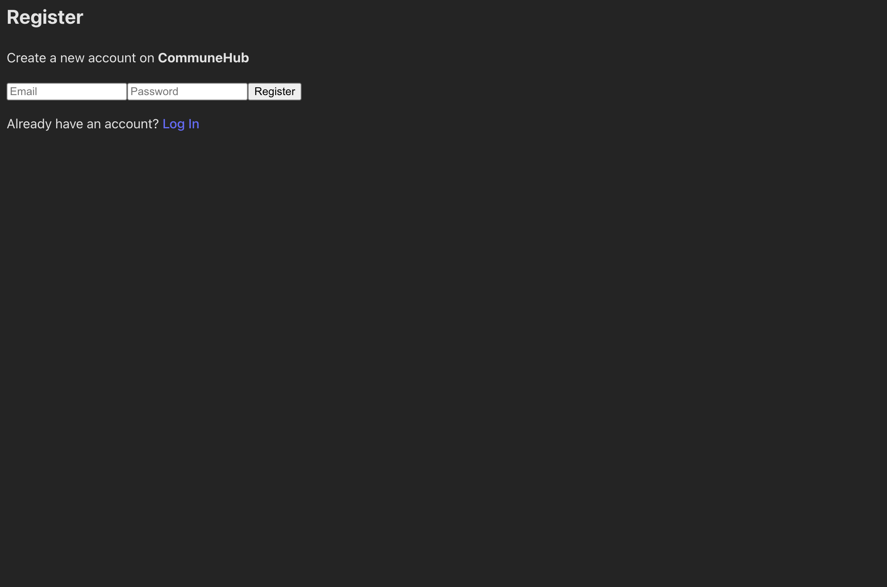

#  CommuneHub – EV Buddy Community Portal

A simple Reddit-style web community portal built for EV Buddy's internship assignment. Users can register/login, post short messages, upvote/downvote, and view a feed sorted by popularity. Admins can also moderate posts.

##  Features

-  User Authentication (Firebase)
-  Post short messages
-  Upvote / 👎 Downvote posts
-  Feed sorted by most upvoted
-  Admin Dashboard to delete inappropriate content
-  Light/Dark Mode toggle
-  Mobile-responsive UI with Tailwind CSS

##  Screenshots

Login Page

###  Register Page

###  Home Feed

### admin Dashboard

##  Tech Stack

- Frontend: React + Vite
- Backend/Auth: Firebase
- Styling: Tailwind CSS
- Deployment: (Optional: Vercel/Netlify)

## 📂 Folder Structure

communehub/
├── src/
│ ├── components/
│ │ ├── Home.jsx
│ │ ├── Login.jsx
│ │ ├── Register.jsx
│ │ ├── AdminDashboard.jsx
│ │ └── ThemeToggle.jsx
│ ├── firebase.js
│ └── App.jsx
├── public/
├── README.md
